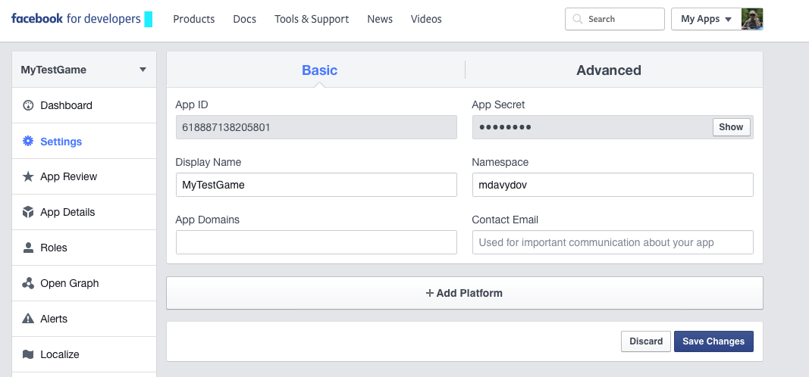

# Лабораторна робота № 4. Мережева взаємодія мобільних додатків

**Мета роботи:** ознайомитись з засобами мережевої взаємодії мобільних додатків. Навчитись створювати засоби авторизації користувачів на мобільній платформі.

Хід роботи:
1. Створити сервіс в Azure Mobile Services (https://portal.azure.com)
2. Створити таблицю в  Azure Mobile Services. Ознайомитись із засобами редагування таблиці і скриптів.
3. Створити приклад програми на Android або iOS для роботи з  Azure Mobile Services.
4. Ознайомитись із засобами авторизації користувачів (див. https://azure.microsoft.com/en-us/documentation/articles/mobile-services-android-get-started-users/)
5. Додати до програми авторизацію з використанням одного з провайдерів авторизації.
6. Заборонити доступ до таблиці для неавторизованих користувачів.
7. Написати звіт.

Додаткові відомості.

Для авторизації з допомогою Facebook необхідно створити програму на Facebook і в налаштуваннях програми додати домен <назва мобільного сервісу>.azure-mobile.net/ як AppDomains і як WebSite/Site URL. Інакше буде помилка при спробі авторизації.

Кроки виконання:

Створення Mobile App Quickstart (бекенд з готовою таблицею)

Скачування готового прикладу, який взаємодії з Azure Mobile Services:

Перевірка таблиці `todoitem`

Заповнення таблиці у програмі:

Перевірка введених значень у таблиці `todoitem`

Перевірка скриптів і колонок таблиці  `todoitem`

Створення додатку на Facebook, щоб дозволити авторизацію користувачів:

Увімкнення авторизації корстувачів з допомогою Facebook: 

Дозвіл на доступ лише авторизованим користувачам: 

Додавання авторизації в мобільний додаток:

